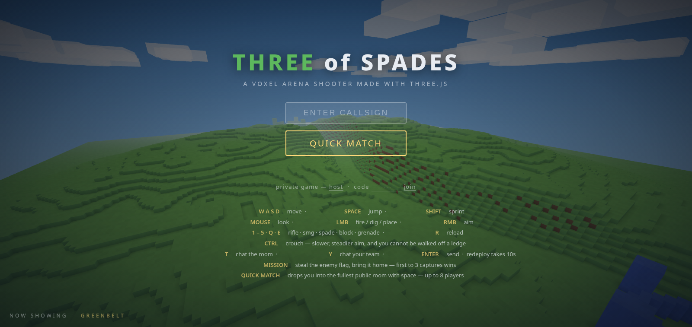
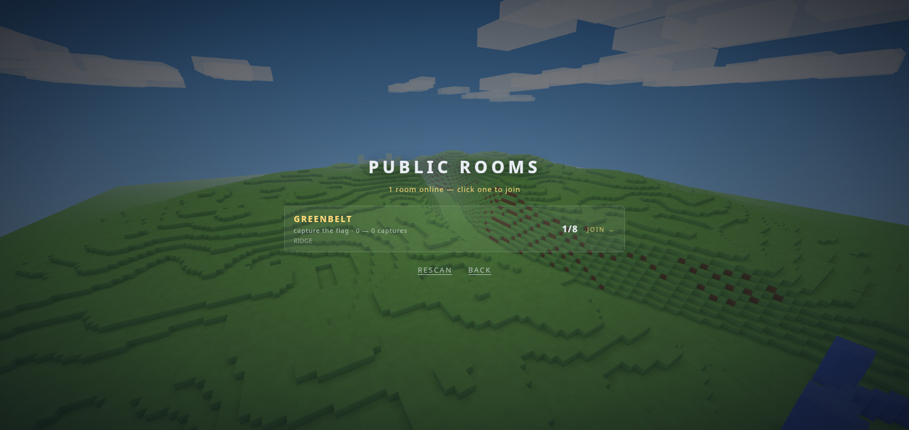
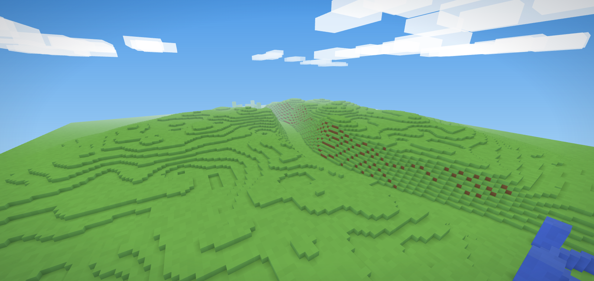
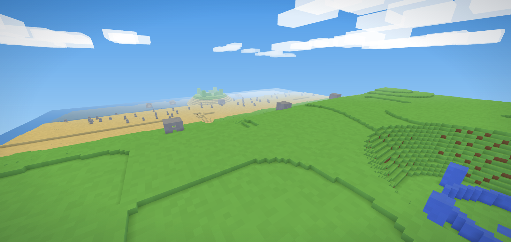
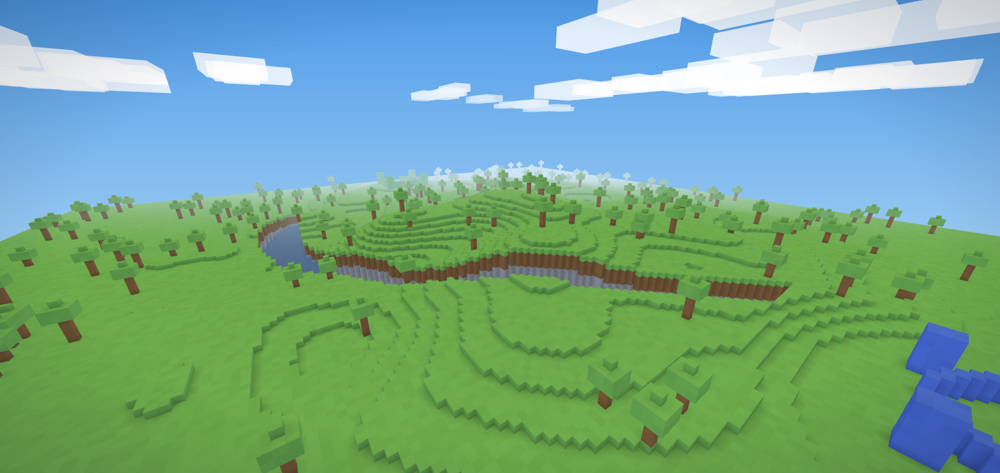
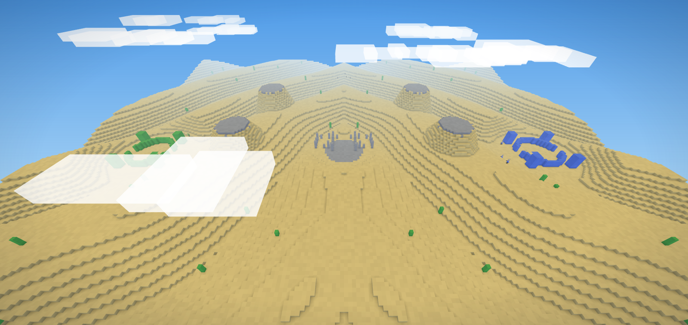
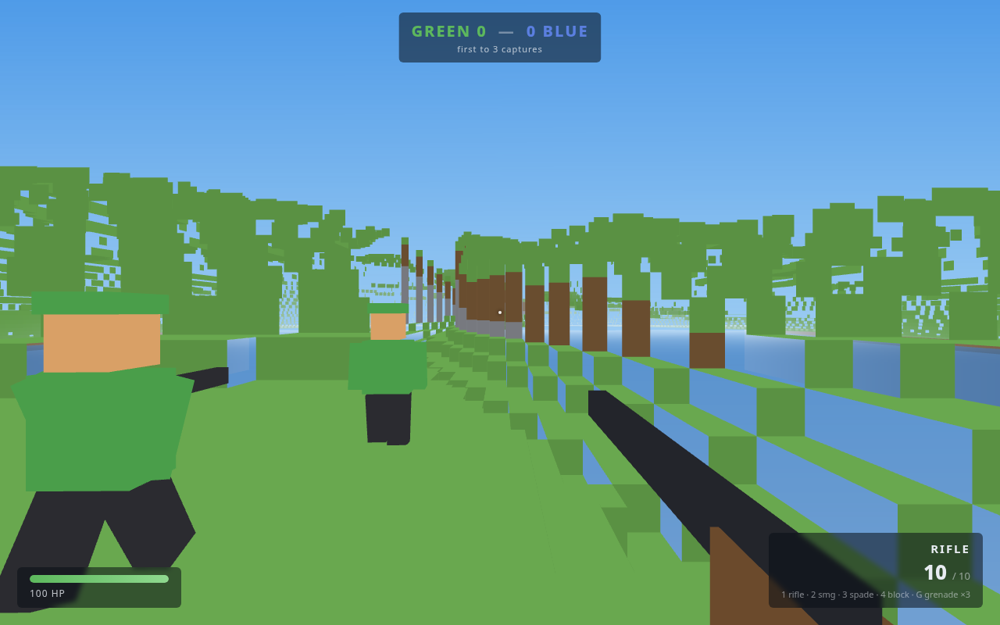

# THREE of SPADES

**A voxel arena shooter made with three.js, running entirely in your browser.**

## ▶ Play now

**[prairielab.net/threeofspades](https://prairielab.net/threeofspades/)**. No install, no build, no terminal. Just click.



## The game

Green vs. Blue on fully destructible voxel battlefields. Dig trenches with
your spade, wall off chokepoints with blocks, crater the midfield with
grenades; even ordinary gunfire chews through cover. Two modes: capture the
flag (steal the enemy flag and run it home, first to 3 captures wins) or team
deathmatch (no flags, pure firefight, first to 20 kills).

Every room runs with AI soldiers who hunt flags, strafe, and will literally dig
through your walls, so a quiet room still plays a full match while it waits for
humans to drop in. When they do, bots step aside to make room, and step back in
if someone leaves.

## Multiplayer

Real browser-to-browser multiplayer over WebRTC. No server, no install, works
straight from GitHub Pages.

QUICK MATCH is the front door. Type a callsign (required, no anonymous
soldiers), click once, and you're in: a searching ticker holds the menu while
matchmaking runs, then the menu drops away straight into the match (no second
click, no DEPLOY gate; `Esc` cancels the search). It peeks at a small set of
deterministic public slots, then joins the fullest room that still has space,
so players pile into the same games instead of scattering across empty ones. If
no room is open, it quietly claims a slot and hosts one for the next
quick-matcher to find. Rooms cap at 8 human players, and humans always split
across opposing teams: you fight *each other*, not side by side against bots.

Every soldier, human or bot, wears its callsign on a floating nametag, tinted
by team and occluded by terrain just like the body beneath it, so you can tell
your buddy from your enemy before you pull the trigger.

Prefer to pick the room yourself? The *browse public rooms* link scans every
public slot at once and lists what answers: map, mode, score, callsigns, and
open seats, fullest room first. Click a row and you drop straight in.



However you end up hosting (a private room, or a quick match that claims an
empty slot), the menu's *when you host* picks apply: pin a favorite map or let
it rotate, and choose capture the flag or team deathmatch. Host migration is
the exception: a promoted replica keeps the room's running map and mode, since
changing the rules mid-match would be cheating.

Want a private lobby instead? The small `host` / `join` links under the main
button give you a 4-letter room code to share with friends.

The host's browser runs the authoritative match (bots, flags, damage, grenades,
terrain edits); everyone else connects directly to it over a peer-to-peer data
channel. Joining mid-match is fine. Signaling (the initial introduction between
browsers) rides the free PeerJS cloud; after that, gameplay traffic never
leaves the peers.

If the host drops, the match doesn't. Every client keeps a migration-ready
replica (the world edit log plus the last full snapshot), and a heartbeat
watchdog notices when the host goes silent; a killed tab sends no goodbye. The
survivors converge on a deterministic fallback room, the lowest-ranked one
promotes its replica to host mid-stride (bots, score, craters, and all), and
the rest rejoin within seconds. If that host drops too, the baton passes again.
Chat and redeploy timers carry on like nothing happened.

Chat is built in. `T` talks to the whole room, `Y` talks to your team only (the
host relays team chatter to teammates only, so it never crosses the lines),
`Enter` sends, `Esc` walks away. The box sits lower left, dark and opaque with
white text, and the soldier holds still while you type.

### How many players can it handle?

A room holds 8 humans, by design. The host's browser simulates everything, so
the practical limit is the host's upload bandwidth: a full room costs roughly 1
to 3 Mbps of upload, comfortable on most home connections.

Globally there's effectively no cap. There is no game server; every room is
hosted by a player in it, so 10 rooms or 10,000 rooms cost the project nothing.
The only shared infrastructure is the free PeerJS signaling broker, which
handles brief introductions, not gameplay.

The quick-match pool is 16 public slots × 8 seats = 128 concurrent
quick-matchers. Slots are scanned a page of 8 at a time, so the overflow page
only costs anything when the first page is genuinely full (`PUBLIC_PAGES` in
`src/net.js` raises it further). Private rooms draw on 32⁴ ≈ 1.05M possible
codes, each an independent battlefield.

## Maps

Four themed battlefields, seeded so every player generates the identical world.
After each match the room automatically rotates to the next map with a fresh
seed:

| Map | Theme |
|---|---|
| **GREENBELT** | The classic rolling green island. Open hills and midfield ridgelines; pure arena CTF. |
| **BEACHHEAD** | D-Day. Green team storms out of landing craft onto sand thick with tank traps, past their own beach-head pillbox and a trench cut into the bluff; Blue holds the heights in concrete MG pillboxes with firing slits. |
| **PINEFALL** | Dense pine forest cut by a wide, winding creek. Short sightlines and flanking routes, ambush country. |
| **DUNES** | Desert mesas and ridged dunes. Long sniper lanes between sheer rock towers, ruins at midfield. |

|  |  |
|---|---|
|  |  |

The home screen shows them off itself: the menu backdrop is a slow orbit that
cycles through all four maps, thirty seconds apiece, each with a fresh seed.



### Arsenal

| Tool | Behavior |
|---|---|
| **Rifle** | Slow, precise, deadly. Headshots drop anyone. RMB to aim. |
| **SMG** | Fast, sprayable, chews through people and cover alike. |
| **Spade** | Digs any block in one hit, and doubles as a melee weapon. |
| **Blocks** | Place team-colored cover anywhere. Dig blocks back to restock. |
| **Grenades** | Bounce, cook for 2.4s, then carve a real crater out of the map. |

All terrain is destructible: spades and grenades remove blocks outright, and
gunfire chips blocks by the same damage it deals to players. A rifle punches
through a block in 3 shots, an SMG in 7. Cover is temporary.

### Controls

`WASD` move · `Space` jump/swim · `Shift` sprint · `CTRL` crouch (slower,
steadier aim, and a ledge grip: crouch-walking refuses to step off any drop
taller than one block, though single steps still pass so slopes stay walkable)
· `LMB` fire/dig/place/throw · `RMB` aim · `1-5` / `Q`·`E` select tool (the
grenade is slot 5, three per life, one trickles back every 12 s) · `R` reload ·
`T` / `Y` chat the room / your team · `Esc` pause (in a match: resume or back
to the main menu). Death costs 10 seconds on the redeploy timer, for humans and
bots alike, so clearing a base actually clears it. A minimap in the top left
shows the terrain (craters and all), both flag stands, the live position of
each flag, and a wedge for you and which way you're facing.

## Tech notes

There's no build step. Plain ES modules and an import map, with three.js r170
vendored in `vendor/`; any static file server can host it.

The voxel engine (`src/world.js`) is a 256×256×64 world split into 16×16
full-height chunks, meshed with culled faces and classic per-face shading baked
into vertex colors. Hitscan weapons and block picking use DDA raycasting.

All audio is synthesized live with WebAudio: gunfire, digs, explosions, the
capture jingle. The repo contains zero binary assets besides screenshots.

Bots (`src/bots.js`) run a small sense-decide-act loop: acquire targets with
line-of-sight checks, strafe while firing, path toward flags, and shovel
through obstacles when stuck. Swimming counts, so a bot that falls in the
Pinefall creek digs the bank into a staircase and climbs out, overhangs
included. But they'd rather not get their feet wet: a bot whose path ends at a
ravine rim lays a plank bridge ahead of itself and walks across at shovel pace.
Bots caught in the open at rifle range throw up a three-wide knee wall, then
fight from behind it, standing to fire, ducking to reload.

Multiplayer (`src/net.js`) wraps PeerJS in a host-authoritative star: clients
send inputs and actions, the host simulates, and everyone renders snapshots
with about 130 ms of interpolation (`src/avatar.js`). Maps are
seed-deterministic, so joiners regenerate the identical world locally and
replay a compact edit log to catch up on every dug trench and crater. The room
browser is matchmaking's probe with the hood up: hosts answer a ping with a
roster summary (map, mode, score, names), so listing a room never joins it.
Host migration (`src/main.js`) rides on that same edit log: on host silence the
clients elect a successor by peer-id rank, claim the derived room
`<code>-M<n>`, and rebuild the authoritative sim from the last snapshot. The
match survives its host.

## Run it locally

Optional; the live demo above is the same code. But if you want a local copy:

```sh
git clone https://github.com/brookskc/threeofspades.git
cd threeofspades
python3 -m http.server 8000   # or: npx serve
# open http://localhost:8000
```

(Opening `index.html` directly from disk won't work: browsers block ES module
imports over `file://`. Any static server avoids this.)

## Roadmap

- Classic 512² maps, more modes (TC, king of the hill), map seed selector.

## License

[PolyForm Noncommercial 1.0.0](LICENSE), free to play, study, modify, and share
for noncommercial purposes. Commercial use requires a separate license.

*A clean-room tribute to the voxel-shooter genre; not affiliated with any
other project.*
